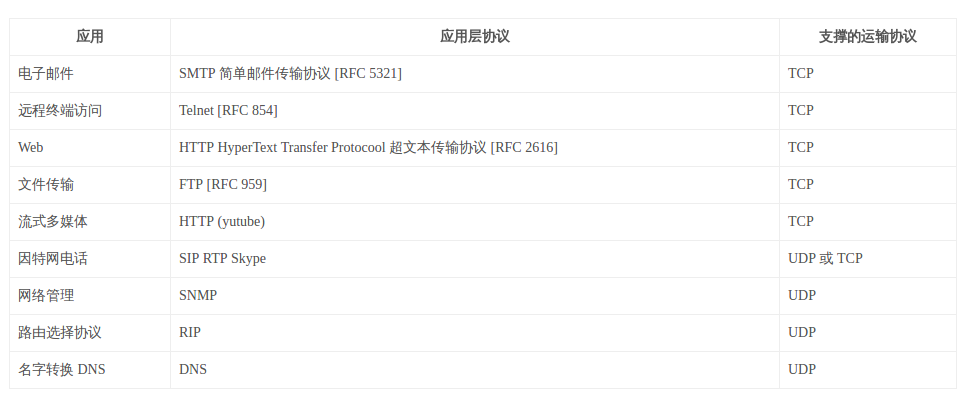
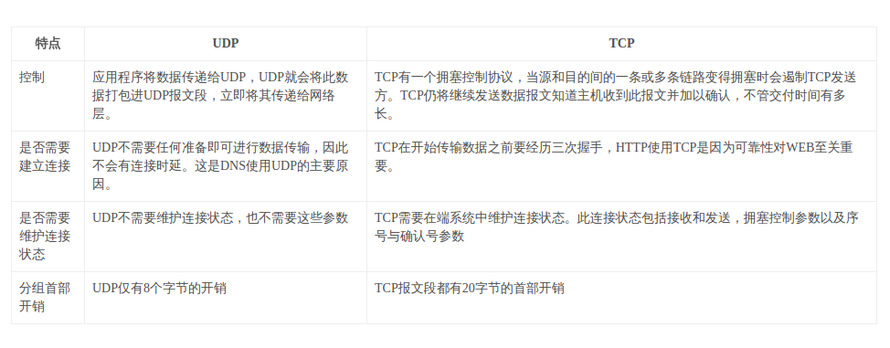
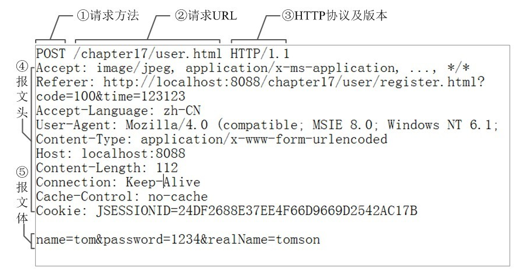
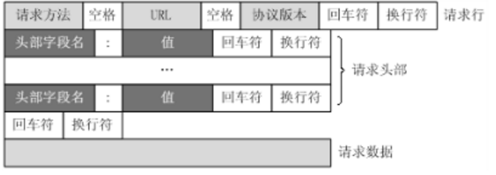

[TOC]

# 应用层协议

## 应用层协议的结构与分类应用

+ 应用程序体系结构包括**客户端-服务器架构**和**P2P体系结构**
+ 客户端-服务器架构
  * 发起通信的进程叫客户
  * 等待联系的进程叫服务器
  * 发送和接受报文的接口叫套接字
  * 通过IP来寻得主机，端口号区分主机上的不同应用程序

## 因特网提供的运输服务

### 因特网应用需求

### TCP服务
#### 特点
1. **面向连接**：发送报文之前经过三次握手，然后建立一条**全双工**连接，发送报文，再销毁连接
2. **可靠**：非常可靠，没有字节丢失和冗余
3. **有拥塞机制**：不一定给自己带来好处，但对整个网络环境友好
4. `TCP`不安全，但有自己的加强版——`SSL`协议

### UDP服务
#### 特点
1. **轻量级**：最小化服务，最小化成本
2. 不可靠：可能发送包丢失和乱序
3. **没有拥塞机制**：可以以任何速率向网络层注入数据

### 注意
不管是`UDP`还是`TCP`，都不提供弹性带宽（吞吐量）保证和时间敏感保证。

### 对比

### 应用层支持的运输层表

## HTTP协议

### 一些web术语和基本概念、约定

+ web文档是由对象组成的。一个对象就是一个文件。对象一般由`URL`来定位。
+ URL：统一资源定位符，主要由两部分组成：一部分是主机名，另一部分是对象们的路径名，是因特网上标准的资源的地址

### HTTP概况
+ `HTTP`一般使用`TCP`作为传输层协议（但HTTP协议中并没有规定必须使用它或它支持的层）
+ `HTTP`是一个无状态协议：`HTTP`服务器不保存客户的任何信息。缺少状态意味着如果后续处理需要前面的信息，则它必须重传，这样可能导致每次连接传送的数据量增大。另一方面，在服务器不需要先前信息时它的应答就较快。
+ `HTTP`是一个无连接协议：限制每次连接只处理一个请求。服务器处理完客户的请求，并收到客户的应答后，即断开连接。采用这种方式可以节省传输时间。
+ `HTTP`是媒体独立的：这意味着，只要客户端和服务器知道如何处理的数据内容，任何类型的数据都可以通过HTTP发送。客户端以及服务器指定使用适合的MIME-type内容类型。

### HTTP非持久连接
+ `HTTP` 0.9和1.0使用非持续连接
+ 在非持续连接下每个tcp只连接一个web对象，连接在每个请求回应对后都会关闭

### HTTP持久连接
+ `HTTP` 1.1+默认使用持续连接 1.0要加`Keep-alive`相应头
+ 一个连接可被多个请求重复利用的保持连接机制被引入，显著地减少了请求延迟，因为客户不用在首次请求后再次进行TCP交互确认创建连接
+ 优点
  * 较少的CPU和内存的使用（由于同时打开的连接的减少了）
  * 允许请求和应答的HTTP管线化
  * 降低网络阻塞 （TCP连接减少了）
  * 减少了后续请求的延迟（无需再进行握手）
  * 报告错误无需关闭TCP连接
+ 缺点
  * 对于现在的广泛普及的宽带连接来说，Keep-Alive也许并不像以前一样有用。web服务器会保持连接若干秒(Apache中默认15秒)，这与提高的性能相比也许会影响性能。
  * 对于单个文件被不断请求的服务(例如图片存放网站)，Keep-Alive可能会极大的影响性能，因为它在文件被请求之后还保持了不必要的连接很长时间。

### HTTP请求报文格式

#### 请求报文
以下是一个典型的请求报文

可以解析为

#### 请求方法
+ `GET`		请求获取Request-URI所标识的资源
  + `POST`	在Request-URI所标识的资源后附加新的数据
    + `HEAD`请求获取由Request-URI所标识的资源的响应消息报头
    + `PUT`请求服务器存储一个资源，并用Request-URI作为其标识
  + `DELETE`请求服务器删除Request-URI所标识的资源
  + `TRACE`请求服务器回送收到的请求信息，主要用于测试或诊断
  + `CONNECT`保留将来使用
  + `OPTIONS`请求查询服务器的性能，或者查询与资源相关的选项和需求

#### 请求URL
+ 统一资源定位符的标准格式如下：  
  协议类型://服务器地址（必要时需加上端口号）/路径/文件名  

+ 而`HTTP`的统一资源定位符将从因特网获取信息的五个基本元素包括在一个简单的地址中：
1. 传送协议(http/https)。
2. 服务器。（通常为域名，有时为IP地址）
3. 端口号。（以数字方式表示，若为HTTP的预设值“:80”可省略）
4. 路径。（以“/”字元区别路径中的每一个目录名称）
5. 查询字符串(query string)。（GET模式的表单参数，以“?”字元为起点，每个参数以“&”隔开，再以“=”分开参数名称与资料，通常以UTF8的URL编码，避开字元冲突的问题）

#### 其他字段
+ Accept：浏览器可接受的MIME类型。
+ Accept-Charset：浏览器可接受的字符集。
+ Accept-Encoding：浏览器能够进行解码的数据编码方式，比如`gzip`。`Servlet`能够向支持`gzip`的浏览器返回经gzip编码的HTML页面。许多情形下这可以减少5到10倍的下载时间。
+ Accept-Language：浏览器所希望的语言种类，当服务器能够提供一种以上的语言版本时要用到。
+ Authorization：授权信息，通常出现在对服务器发送的WWW-Authenticate头的应答中。
+ Connection：表示是否需要持久连接。HTTP1.1默认是`keep-alive`
+ Content-Length：表示请求消息正文的长度。
+ Cookie：这是最重要的请求头信息之一
+ From：请求发送者的email地址，由一些特殊的Web客户程序使用，浏览器不会用到它。
+ Host：初始URL中的主机和端口。
+ If-Modified-Since：只有当所请求的内容在指定的日期之后又经过修改才返回它，否则返回304“Not Modified”应答。
+ Pragma：指定“no-cache”值表示服务器必须返回一个刷新后的文档，即使它是代理服务器而且已经有了页面的本地拷贝。
+ Referer：包含一个URL，用户从该URL代表的页面出发访问当前请求的页面。
+ User-Agent：浏览器类型，如果Servlet返回的内容与浏览器类型有关则该值非常有用。

### HTTP响应报文形式

#### 应答报文
HTTP响应由三个部分组成，分别是：状态行、消息报头、响应正文。以下是响应报文的基本形式：

#### 状态行
状态行格式如下：
HTTP-Version Status-Code Reason-Phrase CRLF
其中：  

+ HTTP-Version表示服务器HTTP协议的版本；
+ Status-Code表示服务器发回的响应状态代码；
+ Reason-Phrase表示状态代码的文本描述。
+ CRLF是换行

#### 响应码
状态代码有三位数字组成，第一个数字定义了响应的类别，且有五种可能取值：

+ 1xx：指示信息--表示请求已接收，继续处理
  * 100 Continue 客户端应当继续发送请求的剩余部分。服务器必须在请求完成后向客户端发送一个最终响应。
  * 101 Switching Protocols 服务器已经理解请求，并将通过Upgrade消息头通知客户端采用不同的协议来完成这个请求。在发送完这个响应最后的空行后，服务器将会切换到在Upgrade消息头中定义的那些协议。
+ 2xx：成功--表示请求已被成功接收、理解、接受
  * 204 No Content 服务器成功处理了请求，但不需要返回任何实体内容，并且希望返回更新了的元信息。响应可能通过实体头部的形式，返回新的或更新后的元信息。
  * 206 Partial Content 服务器已经成功处理了部分GET请求。类似于FlashGet或者迅雷这类的HTTP 下载工具都是使用此类响应实现断点续传或者将一个大文档分解为多个下载段同时下载。该请求必须包含Range头信息来指示客户端希望得到的内容范围，并且可能包含If-Range来作为请求条件。
+ 3xx：重定向--要完成请求必须进行更进一步的操作
  * 300 Multiple Choices 被请求的资源有一系列可供选择的回馈信息，用户或浏览器能够自行选择一个首选的地址进行重定向。
  * 301 Moved Permanently 被请求的资源已永久移动到新位置，将来任何对此资源的引用都应使用本响应返回的若干个URI之一。
+ 4xx：客户端错误--请求有语法错误或请求无法实现
  * 400 Bad Request 由于包含语法错误，当前请求无法被服务器理解。除非进行修改，否则客户端不应该重复提交这个请求。
  * 401 Unauthorized 当前请求需要用户验证。该响应必须包含一个WWW-Authenticate信息头用以询问用户信息。
  * 403 Forbidden 服务器已经理解请求，但是拒绝执行它。
  * 404 Not Found 请求失败，请求所希望得到的资源未被在服务器上发现。
  * 407 Proxy Authentication Required 与401响应类似，只不过客户端必须在代理服务器上进行身份验证。
  * 410 Gone 被请求的资源在服务器上已经不再可用，而且没有任何已知的转发地址。这样的状况应当被认为是永久性的。
  * 421 There are too many connections from your internet address 从当前客户端所在的IP地址到服务器的连接数超过了服务器许可的最大范围
  * 426 Upgrade Required 客户端应当切换到TLS/1.0。
+ 5xx：服务器端错误--服务器未能实现合法的请求
  * 500 Internal Server Error 服务器遇到状况，无法完成对请求的处理。一般来说，这个问题都会在服务器的程序码出错时出现。
  * 501 Not Implemented 服务器无法识别请求的方法，并且无法支持其对任何资源的请求。
  * 502 Bad Gateway 作为网关或者代理工作的服务器尝试执行请求时，从上游服务器接收到无效的响应。
  * 503 Service Unavailable 由于临时的服务器维护或者过载，服务器当前无法处理请求。
  * 504 Gateway Timeout 作为网关或者代理工作的服务器尝试执行请求时，未能及时从上游服务器（URI标识出的服务器，例如HTTP、FTP、LDAP）或者辅助服务器（例如DNS）收到响应。注意：某些代理服务器在DNS查询超时时会返回400或者500错误。

#### 消息报头
+ Location 响应报头域用于重定向接受者到一个新的位置。Location响应报头域常用在更换域名的时候。
+ Server响应报头域包含了服务器用来处理请求的软件信息。与User-Agent请求报头域是相对应的。
+ WWW-Authenticate 必须被包含在401（未授权的）响应消息中，客户端收到401响应消息时候，并发送Authorization报头域请求服务器对其进行验证时，服务端响应报头就包含该报头域。
+ Content-Encoding 它的值指示了已经被应用到实体正文的附加内容的编码，因而要获得Content-Type报头域中所引用的媒体类型，必须采用相应的解码机制。Content-Encoding这样用于记录文档的压缩方法，eg：Content-Encoding：gzip
+ Content-Language 实体报头域描述了资源所用的自然语言。没有设置该域则认为实体内容将提供给所有的语言阅读
  者。
+ Content-Length 实体报头域用于指明实体正文的长度，以字节方式存储的十进制数字来表示。
+ Content-Type实体报头域用语指明发送给接收者的实体正文的媒体类型。
+ Last-Modified实体报头域用于指示资源的最后修改日期和时间。
+ Expires实体报头域给出响应过期的日期和时间。

## FTP协议

### 一些术语和基本概念、约定
+ **文件传输协议（缩写：FTP）**是用于在网络上进行文件传输的一套标准协议。它属于网络传输协议的应用层。

### FTP概况
+ FTP是一个8位的客户端-服务器协议，能操作任何类型的文件而不需要进一步处理，就像MIME或Unicode一样。
+ FTP有着极高的延时，这意味着，从开始请求到第一次接收需求数据之间的时间，会非常长；并且不时的必须执行一些冗长的登陆进程。
+ FTP服务一般运行在20和21两个端口。端口20用于在客户端和服务器之间传输数据流，而端口21用于传输控制流，并且是命令通向ftp服务器的进口。
+ 当数据通过数据流传输时，控制流处于空闲状态。而当控制流空闲很长时间后，客户端的防火墙会将其会话置为超时，这样当大量数据通过防火墙时，会产生一些问题。此虽然文件可以成功的传输，但因为控制会话会被防火墙断开；传输会产生一些错误。
+ 运行FTP服务的许多站点都开放匿名服务，匿名用户的用户名是：“anonymous”。这个帐号不需要密码。
+ FTP是个有状态连接 必须追踪用户所在的文件树

### FTP缺点
+ 密码和文件内容都使用明文传输，可能发生窃听。
+ 因为必须开放一个随机的端口以创建连接，当防火墙存在时，客户端很难过滤处于主动模式下的FTP流量。这个问题，通过使用被动模式的FTP，得到了很大解决。
+ 服务器可能会被告知连接一个第三方计算机的保留端口。
+ 此方式在需要传输文件数量很多的小文件时，性能不好。

### 主动和被动模式
FTP有两种使用模式：主动和被动。主动模式要求客户端和服务器端同时打开并且监听一个端口以创建连接。在这种情况下，客户端由于安装了防火墙会产生一些问题。所以，创立了被动模式。被动模式只要求服务器端产生一个监听相应端口的进程，这样就可以绕过客户端安装了防火墙的问题。  

一个主动模式的FTP连接创建要遵循以下步骤：

1. 客户端打开一个随机的端口（端口号大于1024，在这里，我们称它为x），同时一个FTP进程连接至服务器的21号命令端口。此时，该tcp连接的来源地端口为客户端指定的随机端口x，目的地端口（远程端口）为服务器上的21号端口。
2. 客户端开始监听端口（x+1），同时向服务器发送一个端口命令（通过服务器的21号命令端口），此命令告诉服务器客户端正在监听的端口号并且已准备好从此端口接收数据。这个端口就是我们所知的数据端口。
3. 服务器打开20号源端口并且创建和客户端数据端口的连接。此时，来源地的端口为20，远程数据(目的地)端口为（x+1）。
4. 客户端通过本地的数据端口创建一个和服务器20号端口的连接，然后向服务器发送一个应答，告诉服务器它已经创建好了一个连接。

## SMTP协议

### 概念与约定

+ **简单邮件传输协议 (SMTP)** 是事实上的在Internet传输email的标准。
+ **邮局协议**（**POP**）是TCP/IP协议族中的一员，主要用于支持使用**客户端**远程管理在服务器上的电子邮件。最新版本为**POP3**，而提供了[SSL](https://zh.wikipedia.org/wiki/SSL)加密的POP3协议被称为**POP3S**。
+ **Internet Message Access Protocol**（缩写为**IMAP**）是一个应用层协议，用来从本地邮件客户端（如Microsoft Outlook、Outlook Express、Foxmail、Mozilla Thunderbird）访问远程服务器上的邮件。
+ POP3和IMAP的区别主要是：
  + POP3是比较老的protocol，主要为了解决本地机器和远程邮件服务器链接的问题，每次邮件会download到本地机器，然后从远程邮件服务器上删掉（当然特殊config除外），然后进行本地编辑。这样的问题是如果从多个终端链接服务器，只有第一个下载的能看到，现在pop4正在讨论中。
  + IMAP是相对比较新的protocol，可以将邮件分文件夹整理，然后这些信息也存在远程的邮件服务器上，读取邮件后，服务器上不删除。原理上IMAP应该是相当于oneline编辑，但现在的mail client基本都有在本地存copy的功能。
+ **多用途互联网邮件扩展**（**MIME**）是一个互联网标准，它扩展了电子邮件标准，使其能够支援：
  - 非ASCII字符文本；
  - 非文本格式附件（二进制、声音、图像等）；
  - 由多部分（multiple parts）组成的消息体；
  - 包含非ASCII字符的头信息（Header information）
+ 此外，HTTP协议中也使用了MIME的框架，标准被扩展为互联网媒体类型。

### SMTP概述

+ SMTP用于将邮件从发送方推送到接收方的**服务器**。(SMTP负责发，POP3/IMAP负责收)
+ SMTP是一个“推”的协议，它不允许根据需要从远程服务器上“拉”来消息。要做到这点，邮件客户端必须使用[POP3](https://zh.wikipedia.org/wiki/%E9%83%B5%E5%B1%80%E5%8D%94%E5%AE%9A)或[IMAP](https://zh.wikipedia.org/wiki/IMAP)。
+ SMTP的局限之一在于它没有对发送方进行身份验证的机制。因此，后来定义了SMTP-AUTH扩展。
+ 只支持7位ASCII码，因此发送非文本之前必须经过一次编码，收到之后必须经过解码才能查看。

### 与HTTP的对比

#### 共同点

1. 都是用于传输文件的
2. 都使用持续连接

#### 不同点

1. HTTP是拉协议，SMTP是推协议，即TCP连接发起者不一样，前者由接收方发起，后者由发送方发起。
2. HTTP无数据限制，SMTP只支持7位ASCII编码格式。
3. 对于富文本，HTTP把该文档拆分成多个部分，分开文本和其他媒体文件，分别发送；而SMTP则直接全部进行ASCII编码，全部放在一个报文之中。

### 邮件报文格式和MIME

通用邮件报文格式如下：

1. From字段：发送者
2. To字段：接受者
3. Subject字段：首部行
4. (空白行)
5. 正文报文体

## DNS协议

### 术语与约定

+ **域名系统**（**DNS**）是互联网的一项服务。它作为将域名和IP地址相互映射的一个**分布式数据库**，能够使人更方便地访问互联网。
+ DNS使用TCP和UDP端口53。
+ DNS每一级域名长度的限制是63个字符，域名总长度则不能超过253个字符。

### dns概述

+ dns用于转换主机名和IP地址。
+ 它是应用层协议，体现在：
  + 是C/S架构
  + 端到端发送dns报文
+ 与其他应用层协议不同的是，dns主要为其他应用层协议服务，而不是直接面向用户。

### dns记录了什么

+ 主机记录（A记录）：用于名称解析的重要记录，将特定的主机名映射到对应主机的IP地址上。
+ 别名记录（CNAME记录）: 将某个别名指向到某个A记录上，这样就不需要再为某个新名字另外创建一条新的A记录。
+ IPv6主机记录（AAAA记录）: 用于将特定的主机名映射到一个主机的IPv6地址。
+ 服务位置记录（SRV记录）: 用于定义提供特定服务的服务器的位置，如主机（hostname），端口（port number）等。
+ NAPTR记录：提供了正则表达式方式去映射一个域名。NAPTR记录非常著名的一个应用是用于[ENUM](https://zh.wikipedia.org/w/index.php?title=ENUM&action=edit&redlink=1)查询。
+ MX记录：记录邮件服务器的别名。某公司的web服务器可以和邮件服务器共享别名。
+ NS记录：记录从哪个dns服务器可以获得某个域(如foo.com)的dns记录，即用于记录查询链。

### dns提供的服务

+ 映射域名与IP地址，并提供别名
+ 为邮件服务器提供别名
+ 负载分配(一个域名多个IP的时候)

### dns域名解析详解

DNS查询有两种方式：**递归**和**迭代**。DNS客户端设置使用的DNS服务器一般都是递归服务器，它负责全权处理客户端的DNS查询请求，直到返回最终结果。而DNS服务器之间一般采用迭代查询方式。

以查询zh.wikipedia.org为例：

- 客户端发送查询报文"query zh.wikipedia.org"至DNS服务器，DNS服务器首先检查自身缓存，如果存在记录则直接返回结果。
- 如果记录老化或不存在，则
  1. DNS服务器向[根域名服务器](https://zh.wikipedia.org/wiki/%E6%A0%B9%E5%9F%9F%E5%90%8D%E4%BC%BA%E6%9C%8D%E5%99%A8)发送查询报文"query zh.wikipedia.org"，根域名服务器返回.org域的权威域名服务器地址，这一级首先会返回的是[顶级域名](https://zh.wikipedia.org/wiki/%E9%A1%B6%E7%BA%A7%E5%9F%9F%E5%90%8D)的权威域名服务器。
  2. DNS服务器向.org域的权威域名服务器发送查询报文"query zh.wikipedia.org"，得到.wikipedia.org域的权威域名服务器地址。
  3. DNS服务器向.wikipedia.org域的权威域名服务器发送查询报文"query zh.wikipedia.org"，得到主机zh的A记录，存入自身缓存并返回给客户端。

### dns工作机制特性

+ dns具有分布式分层次解构
+ dns能够缓存

### dns记录与报文

#### dns记录

dns记录往往由四部分组成。

1. Type：标志这是一条什么记录，见[dns记录了什么](#dns记录了什么)
2. Value：Name的对应值
3. Name：Value的对应值
4. TTL：本记录应该在缓存中呆多久

### dns报文

 

1. 前12字节为**首部域**包括
   + 标识符(16bit数字)：查询的唯一标识
   + 标志(0 or 1)：0是查询 1是回答
2. 查询问题区包括
   + 名字字段：主机名
   + 类型：想查什么记录
3. 回答区：根据问题来回答，可能由多个回答
4. 授权区即权威区，包含其他权威服务器的记录
5. 附加区是一些备注信息

#### 注册dns

应该向注册登记机构注册自己的网络域名和IP地址，才能被查询到。

### dns的安全性

dns大多数情况下是安全的。

1. 对于`DDos`攻击，DNS有包过滤系统和缓存服务，仅在`DDos`攻击指向顶级服务器的时候稍微有些困扰。
2. 可以被中间人攻击(伪造回答哄骗客户主机)和DNS毒害攻击(伪造回答哄骗下一级dns服务器来缓存，从而欺骗客户主机)，但是技术上很难实现。
3. dns服务器本身可被利用于攻击其他服务器，但是至今为止只是个例。

## P2P应用与BitTorrent协议

### 术语与约定

+ **对等式网络**（peer-to-peer， 简称**P2P**），又称点对点技术，是[无中心服务器](https://zh.wikipedia.org/wiki/%E5%8E%BB%E4%B8%AD%E5%BF%83%E5%8C%96)、依靠用户群（peers）交换信息的互联网体系，他的作用在于，减低以往网络传输中的节点，以降低数据丢失的风险。
+ 与有中心服务器的中央网络系统不同，对等网络的每个用户端既是一个节点，也有服务器的功能，任何一个节点无法直接找到其他节点，必须依靠其户群进行信息交流。
+ **BitTorrent协议**（简称**BT**）是用在[对等网络](https://zh.wikipedia.org/wiki/%E5%AF%B9%E7%AD%89%E7%BD%91%E7%BB%9C)中文件分享的网络协议程序。它是用户群对用户群（peer-to-peer），而且用户越多，下载同一文件的人越多，且下载后，继续维持上传的状态，就可以“分享”，成为其用户端节点下载的[种子文件](https://zh.wikipedia.org/wiki/%E7%A7%8D%E5%AD%90%E6%96%87%E4%BB%B6)（.torrent），下载该档案的速度越快。
+ **分布式散列表**（缩写**DHT**）是[分布式计算](https://zh.wikipedia.org/wiki/%E5%88%86%E6%95%A3%E5%BC%8F%E8%A8%88%E7%AE%97)系统中的一类，用来将一个关键值（key）的集合分散到所有在分布式系统中的节点，并且可以有效地将消息转送到唯一一个拥有查询者提供的关键值的节点（Peers）。这里的节点类似散列表中的存储位置。

### 优点

+ P2P能有效地利用空闲的带宽，从而降低服务器压力，甚至不需要服务器
+ 速度快
+ 能够自扩展，因为每个人都可以做种

### BitTorrent协议

#### 下载原理

1. 种子文件本质上是文本文件，包含Tracker信息和文件信息两部分。Tracker信息主要是BT下载中需要用到的Tracker服务器的地址和针对Tracker服务器的设置，文件信息是根据对目标文件的计算生成的，把提供下载的文件虚拟分成大小相等的块，块大小必须为2k的整数次方（虚拟逻辑上的分块），并把每个块的索引信息和Hash验证码写入种子文件中；所以，种子文件就是被下载文件的“索引”。
2. 下载时，BT客户端首先解析种子文件得到Tracker地址，然后连接Tracker(追踪器)服务器。Tracker服务器回应下载者的请求，提供下载者其他下载者（包括发布者）的IP。下载者再连接其他下载者，根据种子文件，两者分别告知对方自己已经有的块，然后交换对方所没有的数据。此时不需要其他服务器参与，分散了单个线路上的数据流量，因此减轻了服务器负担。
3. 下载者每得到一个块，需要算出下载块的Hash验证码与种子文件中的对比，如果一样则说明块正确，不一样则需要重新下载这个块。这种规定是为了解决下载内容准确性的问题。
4. 为了解决某些用户“下完就跑”的现象，一些种子发布站(PT站)有奖惩机制，上传即加分，下载即扣分。

#### 下载特点

1. 越多人下越快
2. **稀缺优先**机制：最稀缺的块优先得到分发

### 分布式散列表

#### 发展背景

研究分布式散列表的主要动机是为了开发点对点系统，这些系统使用不同的方法来解决如何**找到拥有某数据的节点**的问题。DHT是解决这种问题的一个方法。

#### 特性

分布式散列表本质上强调以下特性：

- 离散性：构成系统的节点并没有任何中央式的协调机制。
- 伸缩性：即使有成千上万个节点，系统仍然应该十分有效率。
- 容错性：即使节点不断地加入、离开或是停止工作，系统仍然必须达到一定的可靠度。

